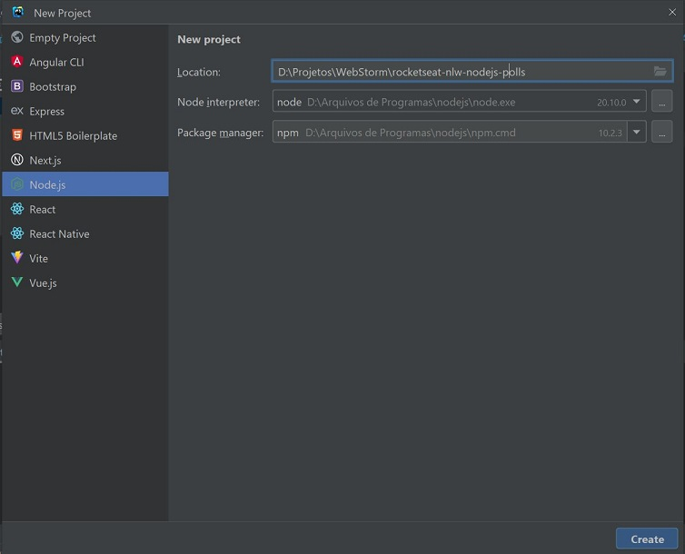
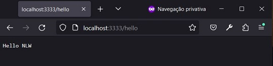

# Rocketseat - NLW - NodeJS - Polls
Rocketseat NLW event project using NodeJS to create Rest API and poll websockets.


## Steps
The steps to develop the project are:
1. Create the NodeJS project in WebStorm:



2. Install and configure **Typescript** through the terminal with:
- `npm install typescript @types/node -D`;
- `npx tsc --init`;
- `npm install tsx -D`.

3. Configure Server:
- Create file `src/http/server.ts`;
- In `package.json`, add `"scripts": {"dev": "tsx watch src/http/server.ts"}`;
- Test execution through the terminal with `npm run dev`.

4. Install and use the fastify framework:
- In the terminal, type `npm i fastify`;
- Change the `src/http/server.ts` file:

```typescript
import fastify from 'fastify'

const app = fastify();

app.get('/hello', () => {
     return 'Hello NLW';
});

app.listen({port: 3333}).then(()=>{
     console.log('HTTP server running!');
});
```

- Test the `http://localhost:3333/hello` route in the browser after starting the server with `npm run dev`.



5. Install and configure Docker:
- Download and install Docker Desktop according to the Operating System: `https://docs.docker.com/get-docker/`;
- Activate virtualization in the Computer BIOS: `Advanced -> CPU Configuration -> SVM Mode = Enabled`;
- Run Docker Desktop (and WebStorm) as Administrator;
- In the terminal, to check the installed version of Docker, type `docker -v`;
- In the terminal, to check the running Docker containers, type `docker ps`;
- Create the file `docker-compose.yml` whose content indicates which services the application needs;

```yaml
version: '3.7'

services:
   postgres:
     image: bitnami/postgresql:latest
     ports:
       - '5432:5432'
     environment:
       - POSTGRES_USER=docker
       - POSTGRESQL_PASSWORD=docker
       - POSTGRESQL_DATABASE=polls
     volumes:
       - polls_pg_data:/bitnami/postgresql

   redis:
     image: bitnami/redis:latest
     ports:
       - '6379:6379'
     environment:
       - ALLOW_EMPTY_PASSWORD=yes
     volumes:
       - polls_redis_data:/bitnami/redis/data

volumes:
   polls_pg_data:
   polls_redis_data:
```

- In the terminal, to run the container services in the background, type `docker compose up -d`;
- In the terminal, to display the logs of one of the containers, type `docker logs <id>`.


## References
Docker Hub - bitnami - Postgresql:
https://hub.docker.com/r/bitnami/postgresql

Docker Hub - bitnami - Redis:
https://hub.docker.com/r/bitnami/redis